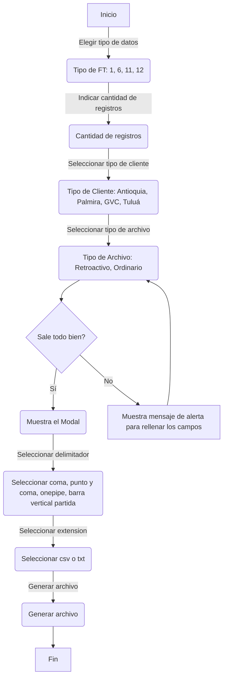

# Generator Data Sintetica

Generador de Datos Sintéticos para pruebas de carga Del portal silin, entidad etc..

## Requisitos
- Java JDK 17 
- Maven 3.6.0 o superior

## Configuración del Entorno

1. **Instalación de Java JDK**: Asegúrate de tener Java JDK 22 o superior instalado en tu sistema. Puedes descargarlo desde [Oracle](https://www.oracle.com/java/technologies/downloads/?er=221886#java22) o cualquier distribución de OpenJDK.

2. **Instalación de Maven**: Necesitas Maven para construir y gestionar el proyecto. Descarga e instala Maven desde [Apache Maven Project](https://maven.apache.org/download.cgi).

3. **Configuración de Variables de Entorno**: Configura las variables de entorno `JAVA_HOME` y `MAVEN_HOME` apuntando a las ubicaciones de instalación de JDK y Maven, respectivamente.

## Instalación

Clona este repositorio en tu máquina local usando:

```bash
git clone {url}
```

Después haberse dirigido al proyecto mediante terminal o con su editor de preferencia **recomendamos intellij idea** o VS CODE
y correr el proyecto para ver la siguiente pantalla principal.


## Flujo de Control del aplicacion


